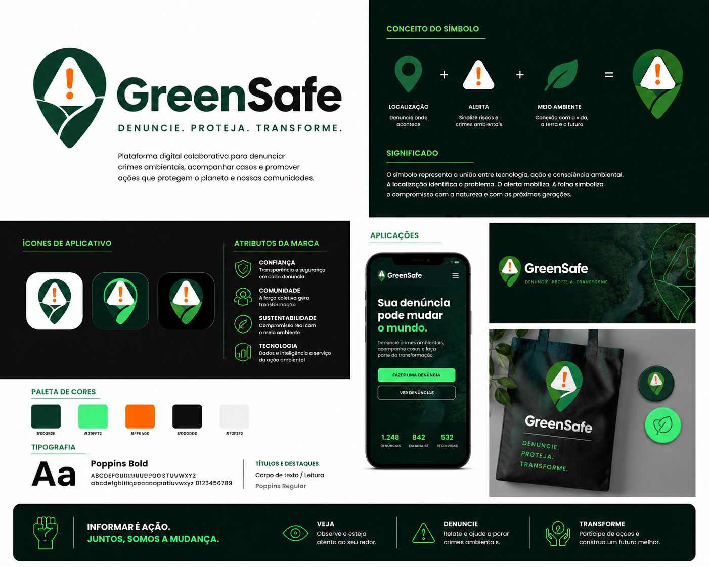
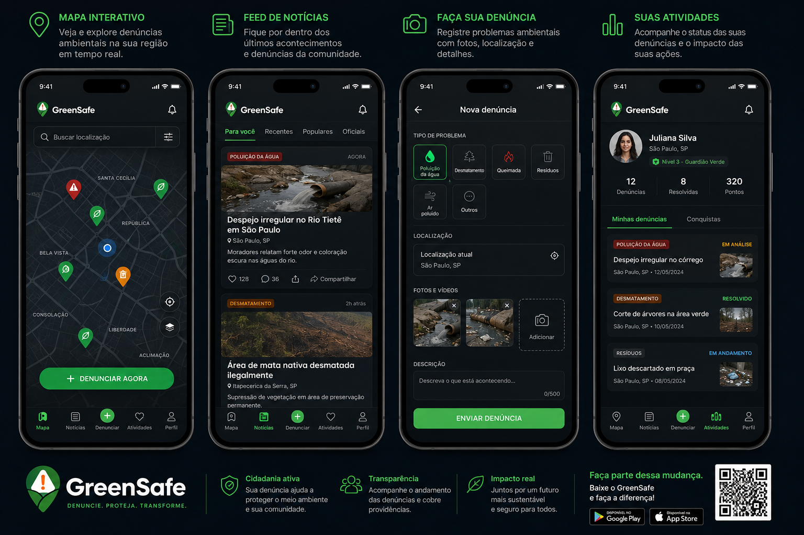
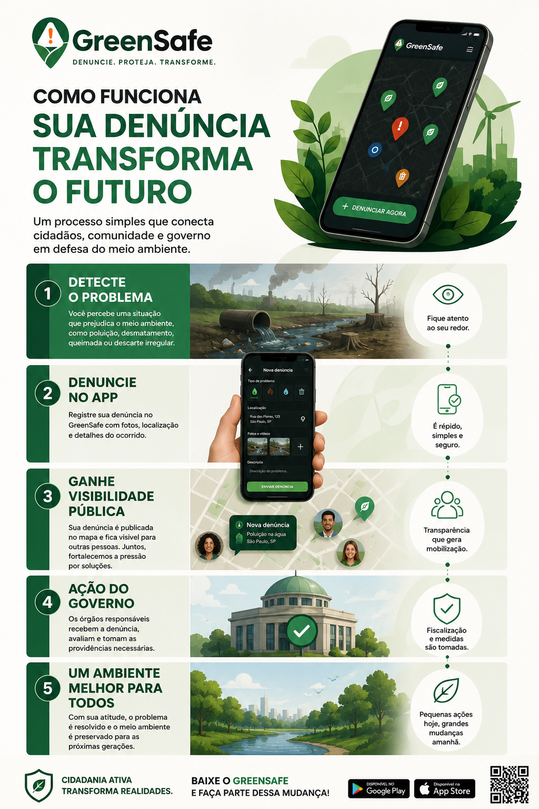
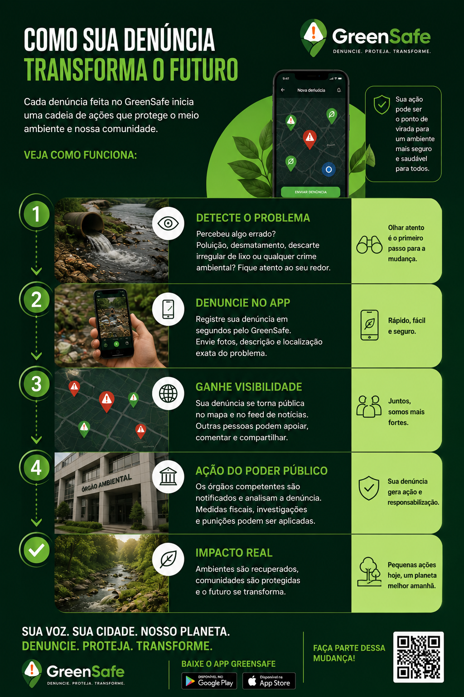
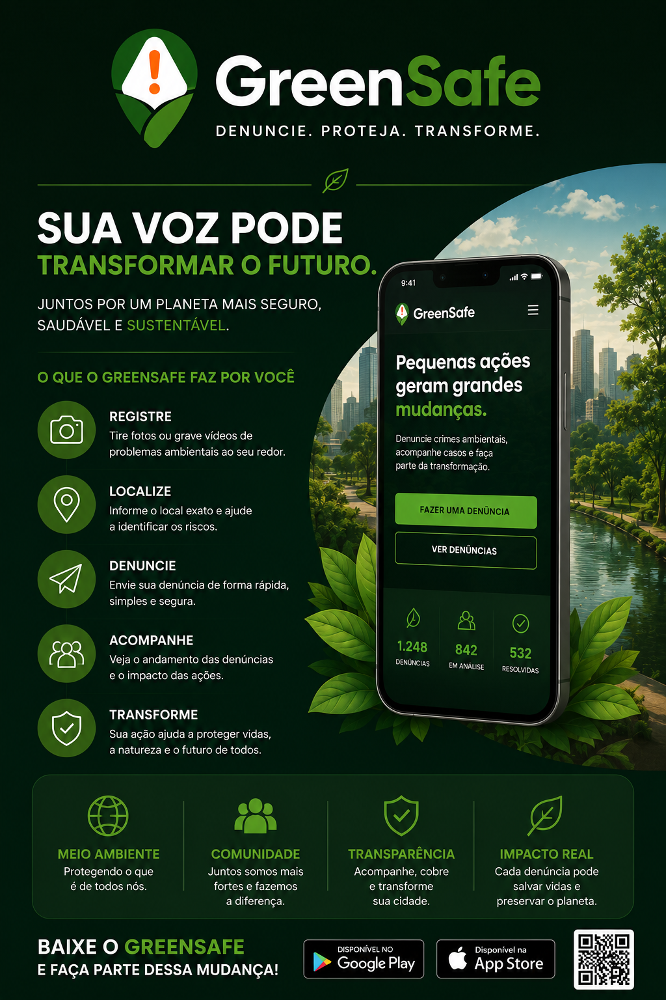
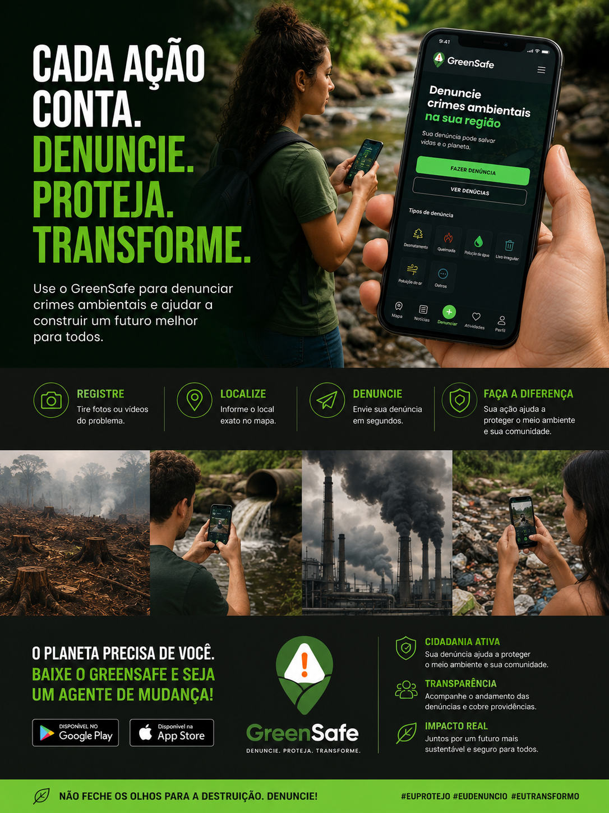
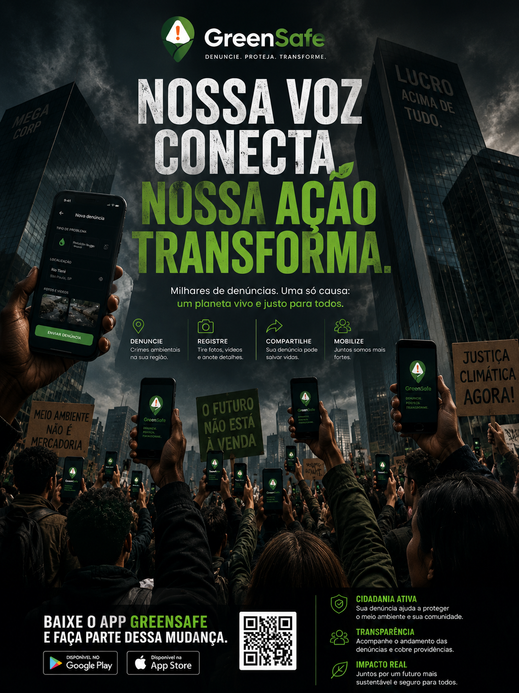
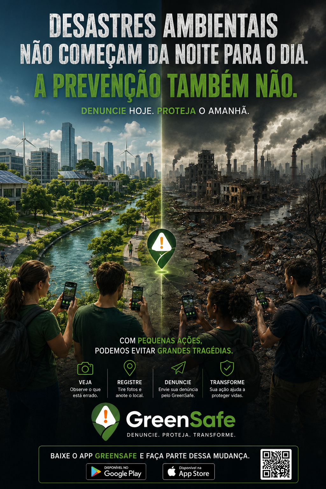

# GreenSafe 🌱

> **Denuncie. Proteja. Transforme.**

## Sobre o Projeto

O **GreenSafe** é uma plataforma digital de conscientização, participação cidadã e mobilização social voltada para o enfrentamento de problemas ambientais urbanos.

A proposta do projeto é criar uma ponte entre cidadãos, comunidade e poder público, permitindo que situações como poluição, descarte irregular de resíduos, queimadas, desmatamento e outros crimes ambientais sejam identificadas, registradas e acompanhadas de forma transparente.

Mais do que uma ferramenta tecnológica, o GreenSafe busca incentivar a participação ativa da sociedade na construção de cidades mais sustentáveis, alinhando-se aos Objetivos de Desenvolvimento Sustentável (ODS), especialmente:

- 🏙️ **ODS 11 – Cidades e Comunidades Sustentáveis**
- ♻️ **ODS 12 – Consumo e Produção Responsáveis**

---

## Problema

Muitos problemas ambientais permanecem invisíveis por falta de mecanismos acessíveis de denúncia e acompanhamento.

Mesmo quando identificados, cidadãos frequentemente enfrentam dificuldades para:

- Comunicar o problema aos órgãos responsáveis;
- Acompanhar o andamento da denúncia;
- Mobilizar outras pessoas em torno da causa;
- Gerar visibilidade para questões ambientais locais.

O GreenSafe surge como uma solução para ampliar a participação popular e fortalecer a fiscalização colaborativa.

---

## Objetivo

O objetivo principal do GreenSafe é:

> Transformar denúncias ambientais em ações concretas por meio da participação cidadã, transparência e mobilização social.

A plataforma incentiva que qualquer pessoa possa contribuir para a preservação ambiental de sua comunidade.

---

## Como Funciona

### 1️⃣ Detecte o Problema

O cidadão identifica uma situação que causa impacto ambiental, como:

- Poluição
- Desmatamento
- Queimadas
- Descarte irregular de resíduos
- Contaminação de rios e córregos

### 2️⃣ Registre a Denúncia

A ocorrência é documentada por meio de fotos, localização e descrição do problema.

### 3️⃣ Ganhe Visibilidade Pública

A denúncia torna-se visível para a comunidade, promovendo conscientização e engajamento coletivo.

### 4️⃣ Ação dos Órgãos Responsáveis

As informações podem ser utilizadas para análise, fiscalização e tomada de providências.

### 5️⃣ Impacto Positivo

A mobilização da sociedade contribui para a preservação ambiental e melhoria da qualidade de vida.

---

## Identidade Visual

A identidade visual do GreenSafe foi desenvolvida para transmitir:

- Confiança
- Urgência
- Responsabilidade ambiental
- Tecnologia
- Participação social

### 🎨 Paleta Principal

| Cor | Hex |
|-------|---------|
| Verde Escuro | `#0D3B2E` |
| Verde Neon | `#39FF72` |
| Laranja Alerta | `#FF6A00` |
| Off White | `#F7F7F2` |
| Preto Grafite | `#111111` |

---

# Materiais Gráficos Desenvolvidos

## 🟢 Logo e Branding

- Logo GreenSafe
- Sistema visual institucional
- Aplicações para apresentações

## 📱 Interface do Aplicativo

Protótipo conceitual contendo:

- Mapa interativo
- Feed de ocorrências
- Cadastro de denúncias
- Upload de imagens
- Sistema de localização

## 📊 Infográfico Institucional

Fluxo completo da jornada do usuário:

1. Detectar problema
2. Registrar denúncia
3. Gerar visibilidade
4. Acionar órgãos responsáveis
5. Promover impacto positivo

## 📢 Peças de Conscientização

- Campanhas sociais
- Cartazes de mobilização
- Artes para redes sociais
- Conceitos de ativismo digital

---

## Galeria do Projeto

### Logo GreenSafe

```text
/Produtos/identidade-visual.png
```



### Prototipo Interface

```text
Produtos/prototipo-interface.png
```



### Infográfico Claro Completo

```text
Produtos/infografico1.png
```



### Infográfico Escuro Completo

```text
Produtos/infografico2.png
```



### Cartaz Digital

```text
Produtos/cartaz-digital.png
```



### Campanha Rede Social 1

```text
Produtos/rede-social1.png
```



### Campanha Rede Social 2

```text
Produtos/rede-social2.png
```
![logo](Produtos/rede-social2.png


### Campanha Rede Social 3

```text
Produtos/rede-social3.png
```



### Campanha Rede Social 4

```text
Produtos/rede-social4.png
```


---

## Visão de Futuro

O GreenSafe pretende se tornar uma plataforma de referência em participação cidadã ambiental, permitindo que comunidades atuem de forma colaborativa na identificação e solução de problemas que impactam o meio ambiente.

Acreditamos que pequenas ações locais podem gerar grandes transformações coletivas.

---

## Slogan

> **Denuncie. Proteja. Transforme.**

---

# Uso de Inteligência Artificial

A Inteligência Artificial foi um pilar técnico e criativo fundamental ao longo de todo o fluxo de desenvolvimento do projeto. Em total conformidade com as diretrizes acadêmicas da atividade, seu uso ocorreu de forma consciente e responsável, atuando como uma ferramenta de apoio e aceleração do processo criativo, sem substituir a participação ativa da equipe nas decisões de design, concepção e validação dos resultados.

Cada ferramenta utilizada desempenhou um papel específico na construção do produto final:

### 🤖 ChatGPT (OpenAI)

O ChatGPT foi utilizado como principal ferramenta de apoio para a criação de materiais visuais e conceituais do projeto.

Suas contribuições incluíram:

- Geração de imagens conceituais e publicitárias;
- Criação de elementos gráficos para campanhas de conscientização;
- Desenvolvimento de ilustrações e cenários utilizados nos materiais visuais;
- Apoio na construção da identidade visual da plataforma;
- Elaboração de infográficos, mockups e peças de comunicação do GreenSafe.

A ferramenta contribuiu significativamente para a prototipação rápida de ideias visuais e para a construção da narrativa gráfica do projeto.

---

### 🧠 Claude (Anthropic)

O Claude foi utilizado como parceiro estratégico para atividades de reflexão, planejamento e produção textual.

Entre suas principais contribuições destacam-se:

- Estruturação conceitual da proposta;
- Organização lógica do funcionamento da plataforma;
- Refinamento de ideias e funcionalidades;
- Produção e revisão de textos institucionais;
- Criação de mensagens de conscientização ambiental;
- Desenvolvimento de slogans e textos de impacto.

Um exemplo de resultado obtido foi a construção do slogan principal da campanha:

> **"Denuncie. Proteja. Transforme."**

---

### 🎥 Gemini (Google)

O Gemini foi empregado no desenvolvimento do conteúdo audiovisual do projeto.

Sua utilização incluiu:

- Apoio na criação do roteiro do vídeo;
- Estruturação da narrativa audiovisual;
- Sugestões para organização visual das cenas;
- Auxílio na comunicação dos objetivos da plataforma por meio de vídeo.

Essa ferramenta contribuiu para tornar a apresentação mais dinâmica, acessível e envolvente para o público.

---

## Considerações sobre o Uso de IA

O uso combinado dessas ferramentas possibilitou:

- Maior agilidade no processo de criação;
- Exploração de diferentes abordagens criativas;
- Produção de materiais visuais com qualidade profissional;
- Aprimoramento da comunicação visual e textual do projeto;
- Expansão das possibilidades de prototipação e validação de ideias.

Entretanto, todas as imagens, textos, conceitos, propostas visuais e demais conteúdos gerados por Inteligência Artificial foram cuidadosamente analisados, revisados e adaptados pelos integrantes da equipe.

As decisões finais sobre design, conteúdo, identidade visual e direcionamento do projeto permaneceram sob responsabilidade dos autores, garantindo alinhamento com os objetivos do GreenSafe e com os princípios éticos e acadêmicos da atividade.

Dessa forma, a Inteligência Artificial foi utilizada como uma ferramenta de apoio ao processo criativo, atuando como facilitadora na produção de conteúdo, sem substituir a participação humana na concepção, avaliação e tomada de decisões do projeto.

## Autores

**GABRIEL NEULES GOMES RODRIGUES SOARES - RA 822167394**</br>
**GUILHERME SALES DE ANDRADE - RA 825125938**</br>
**HENRYK BAGDANOVICIUS ROZA - RA 823135401**</br>
**LUCAS VASCONCELLOS RAMOS DE SOUSA - RA 8222242697**</br>
**PALOMA LOPES DE SOUSA - RA 822167506**</br>
**WELLERSON RESENDE MONTEIRO - RA 8222243349**</br>

Projeto Integrador – Computação Gráfica
ODS e Inteligência Artificial

🌎💚